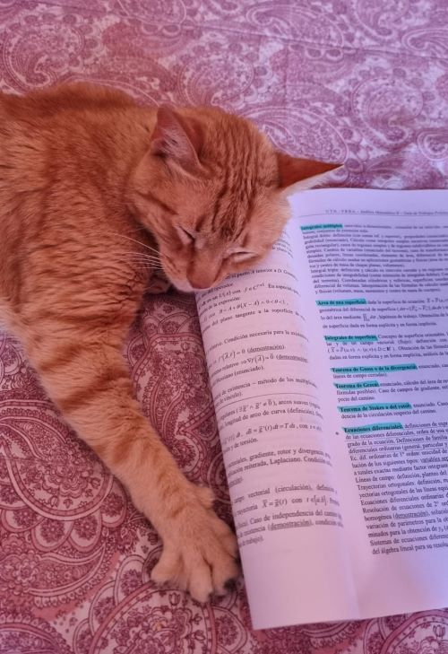

# Mi presentación
___
* Mi nombre es *Camila Belén Lencina*.
* Mi legajo es *215.042-6* (recién este año me lo pude aprender de memoria).
* Estoy cursando la mayoría de las materias de 2do año, incluyendo Sistemas Operativos D:
* Me encanta SNK así que me hizo feliz que mencionaran a Eren en la consigna 😎
* Espero aprender mucho en esta materia; me comentaron que te hace pensar la programación de formas diferentes.
### Adjunto foto mía que posta es mía.

### Y una foto de mi gato "estudiando" para Análisis Matemático 2.

